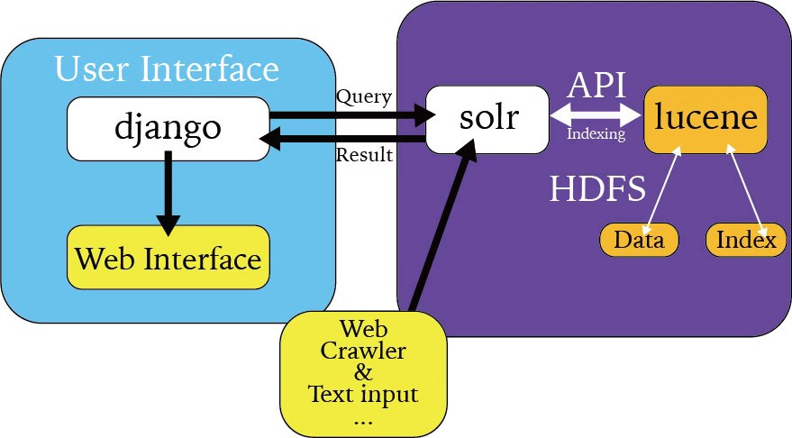
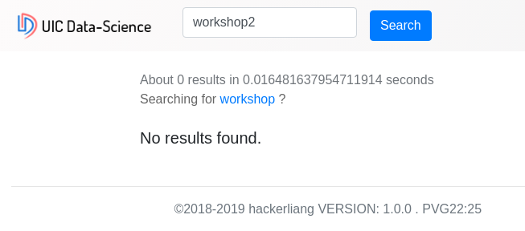
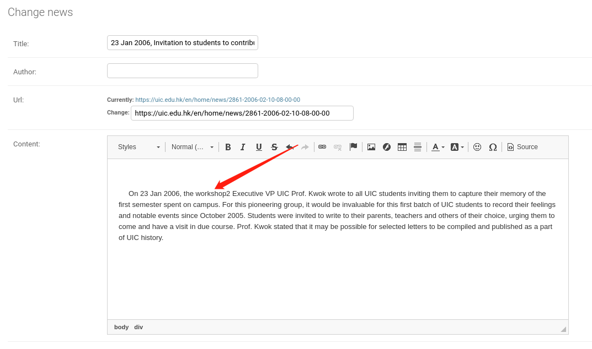
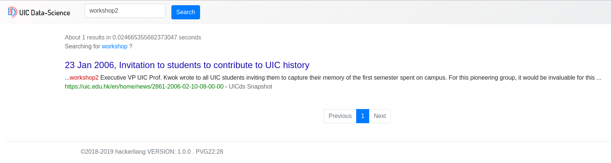

# DS 3003 Data Processing Workshop II

[TOC]

# Crawler And Search

## Group member

- m730026058 ChangyuanLIANG

## Text files collection

> - Web Crawler
>   - UIC Official Website
>     - https://uic.edu.hk/en/home/news
>     - 1303 News**(2006-02-10 to 2019-11-29)**
>     - Script on *spider/uic_official_website.py*
>   - Gutenberg eBook
>     - http://www.gutenberg.org
>     - 3000+ eBook**(1.2GiB)**
>     - Script on *spider/gutenberg.py*
> - Dynamically collection and real time indexing
>   - Achieved, will be explained later

## Indexing and ranking

### Indexing

>- Code
>  - [TF_IDF_Indexing](https://github.com/hackerliang/TF-IDF-MapReduce)
>- Explanation
>  - A python script that comply with system standard input and output, that means this script can both run on hadoop mapreduce and single computer(Assignment4).
>  - Time
>    - Single Computer
>      - 10s (10MiB)
>      - 20min (200MiB)**[Sometimes out of memory]**
>    - MapReduce
>      - 1min (10MiB)
>      - 2min (200MiB)
>- Lucene
>  - Achieved, will be explained later

### Ranking

>- Code
>  - [TF_IDF_Indexing](https://github.com/hackerliang/TF-IDF-MapReduce)
>- Explanation
>  - A python script that comply with system standard input and output, that means this script can both run on hadoop mapreduce and single computer(Assignment4).
>- For txt file, we use TF-IDF as our ranking algorithm
>- For web pages
>  - Implement by Lucene
>    - Achieved, will be explained later
>  - Implement by myself(TD-IDF)
>    - Simply the same as TF-IDF, but remove the labels(\<p\>, \, \<div\>...)

## Web server and interface

The search result collected by a web server returned to the querying user, which look like this:

>- Advanced features
>  - Boost
>    - We can add different weight to different on different content
>    - For example, I search for the "DHSS" without add addition weight for the title
>      - 
>    - Search for "DHSS" and add weight for the title
>      - 
>  - Highlight
>    - We can mark the keywords **red**, as shown in the previous picture.
>  - Pagination
>    - When there are more than 10*(This value can be modified)* search results, we will paginate the results
>      - 
>  - Input correction and suggestion
>    - We will provide suggestions if there are too few search results or misspellings
>      - 
>  - Searching based on phrases
>    - We offer phrase based searches, not just single word searches
>      - 
>  - Link to the relevant content directly
>    - We can hyperlink to the source of this content
>      - As you can see from the above images, there are hyperlink in green below each search result, which can link to the content relevant directly
>  - The context around the keyword
>    - As shown in the figure above, the context around the keyword is printed out.
>  - Snapshot for the website(include images)
>    - As shown in the figure above, there are "UICds Snapshot" behind the hyperlink
>      - Snapshot(include images)
>        - 
>
>

# Overall System Design

- As you can see in the above figure, I use Django as the connection tool between user and server. Django will send the search query to Solr, and Solr will return result as json to Django, then Django will render the html page.

- Whenever I inject new data to solr, solr will automatically call lucene via API, ask lucene to do the index. Lucene will store data and index in HDFS.

  
**A Dynamic data collection and Dynamic update index System**

- A Dynamic data collection and Dynamic update index System

  - There is a crawler script that will detect if the website is updated(in real time). If there is new content, the script will pass the new content to solr and update the index. This will be done in 1 second.
  - Of course, there is also a crawler script that can continuously crawl content, such as the Gutenberg project, where there are thousands of e-books, and the script can continuously crawl and update the index in real time.
  - Not only that, if the local data is changed, the index can be updated in real time.
    - At the beginning, we searched for "workshop2" and found nothing
    - 
    - Then we add the word "workshop2" to the local data
    - 
    - Then we searched again for "workshop2" and found that it would be searched immediately
    - 

  In general, I think my system has done a very good job. It can collect, analyze and index data in real time. It can also re index the modified data in real time. At first I thought about the combination of Lucene and MapReduce, but MapReduce is not suitable for analyzing data in real time. His calculation speed is relatively slow. The intermediate results calculated by MapReduce will be written to disk, and the output results will also be written to disk. Reading and writing to disk means that performance cannot meet real-time requirements. This means that only one of MapReduce and real-time index can be selected. But in pursuit of real-time analysis and re-indexing, I abandoned MapReduce. Next, I will try to integrate them, such as MapReduce for offline analysis and indexing, and tools such as spark for real-time indexing.