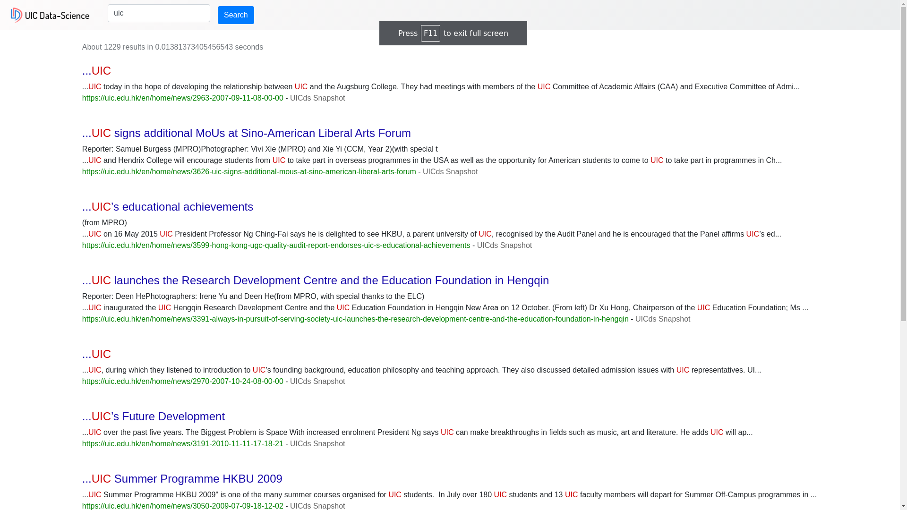
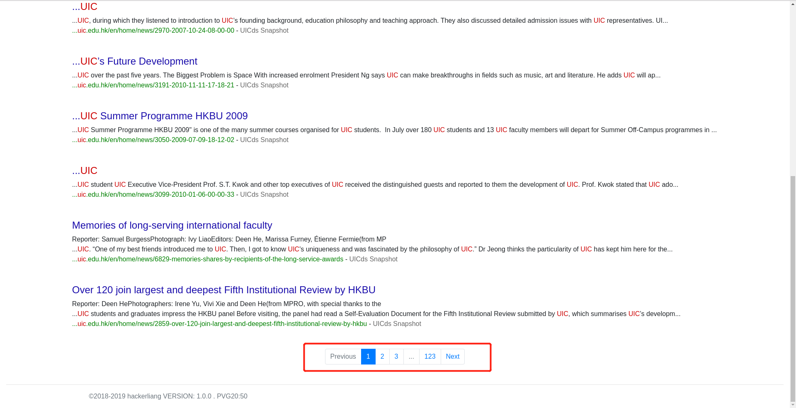
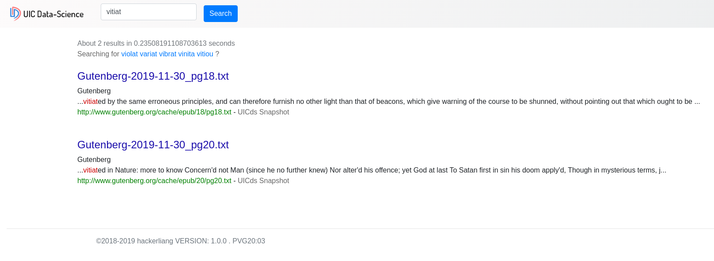
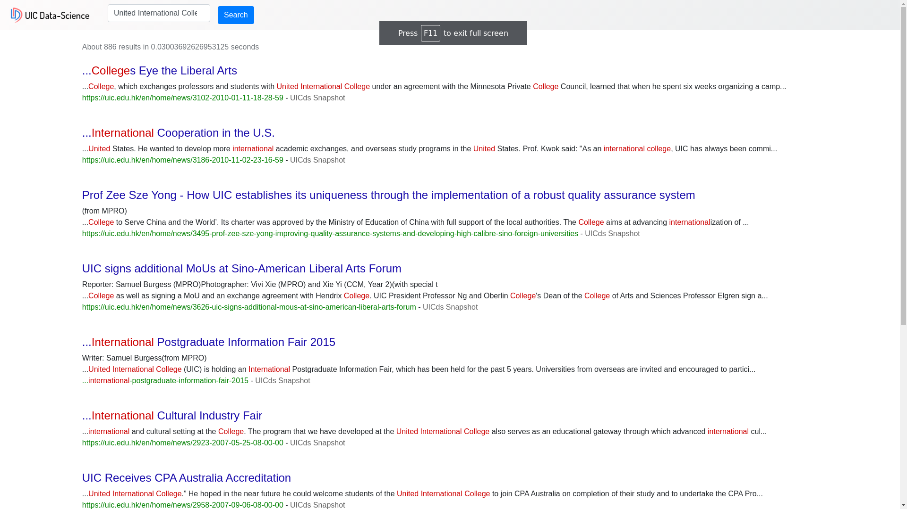
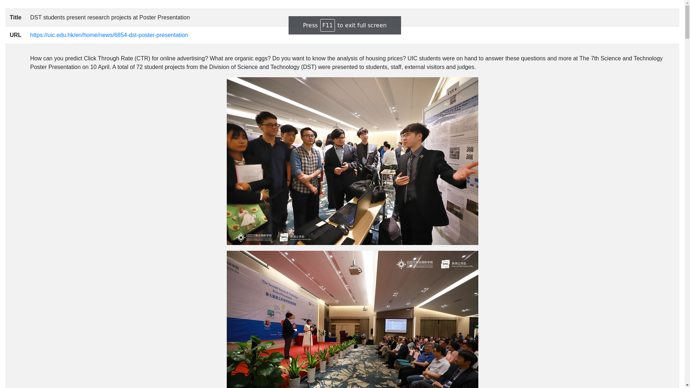

# DS 3003 Data Processing Workshop II

[TOC]

# Crawler And Search

## Group member

- m730026058 ChangyuanLIANG

## Text files collection

> - Web Crawler
>   - UIC Official Website
>     - https://uic.edu.hk/en/home/news
>     - 1303 News**(2006-02-10 to 2019-11-29)**
>     - Script on *spider/uic_official_website.py*
>   - Gutenberg eBook
>     - http://www.gutenberg.org
>     - 3000+ eBook**(1.2GiB)**
>     - Script on *spider/gutenberg.py*
> - Dynamically collection and real time indexing
>   - Achieved, will be explained later

## Indexing and ranking

### Indexing

>- Code
>  - [TF_IDF_Indexing](https://github.com/hackerliang/TF-IDF-MapReduce)
>- Explanation
>  - A python script that comply with system standard input and output, that means this script can both run on hadoop mapreduce and single computer(Assignment4).
>  - Time
>    - Single Computer
>      - 10s (10MiB)
>      - 20min (200MiB)**[Sometimes out of memory]**
>    - MapReduce
>      - 1min (10MiB)
>      - 2min (200MiB)
>- Lucene
>  - Achieved, will be explained later

### Ranking

>- Code
>  - [TF_IDF_Indexing](https://github.com/hackerliang/TF-IDF-MapReduce)
>- Explanation
>  - A python script that comply with system standard input and output, that means this script can both run on hadoop mapreduce and single computer(Assignment4).
>- For txt file, we use TF-IDF as our ranking algorithm
>- For web pages
>  - Implement by Lucene
>    - Achieved, will be explained later
>  - Implement by myself(TD-IDF)
>    - Simply the same as TF-IDF, but remove the labels(
, , 
)

## Web server and interface

The search result collected by a web server returned to the querying user, which look like this:

>- Advanced features
>  - Boost
>    - We can add different weight to different on different content
>    - For example, I search for the "DHSS" without add addition weight for the title
>      - 
>    - Search for "DHSS" and add weight for the title
>      - 
>  - Highlight
>    - We can mark the keywords **red**, as shown in the previous picture.
>  - Pagination
>    - When there are more than 10*(This value can be modified)* search results, we will paginate the results
>      - 
>  - Input correction and suggestion
>    - We will provide suggestions if there are too few search results or misspellings
>      - 
>  - Searching based on phrases
>    - We offer phrase based searches, not just single word searches
>      - 
>  - Link to the relevant content directly
>    - We can hyperlink to the source of this content
>      - As you can see from the above images, there are hyperlink in green below each search result, which can link to the content relevant directly
>  - The context around the keyword
>    - As shown in the figure above, the context around the keyword is printed out.
>  - Snapshot for the website(include images)
>    - As shown in the figure above, there are "UICds Snapshot" behind the hyperlink
>      - Snapshot(include images)
>        - 
>
>

